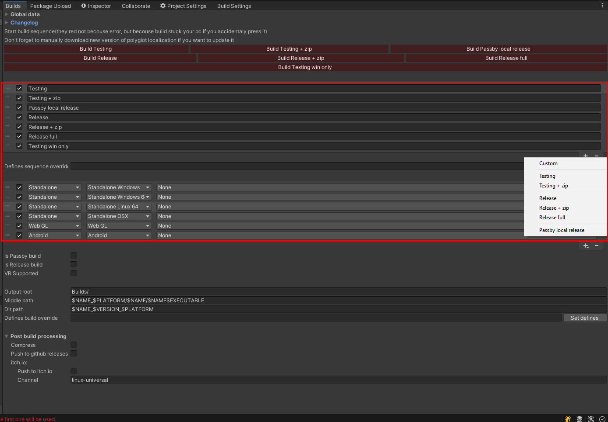

# Build & Changelog manager

## Description
Utility for running builds sequence &amp; pushing them to itch.io and github

'Build & Changelog manager' is an asset that can:
 * Run multiple builds
 * Archivate build
 * Push build to itch.io
 * Push build to Github releases
 * Auto optimize release builds for better performace and testing builds for faster build time
 * Maintain defines and options for each build and sequence
 * Keep changelog and readme files
 * Auto add changelog and readme to game folders
 
 
## Editor window & how to use it
  


---------------------

### Global data
  

---------------------

### Build buttons
 

---------------------

### Sequence general
 

---------------------

### Sequence settings
 

---------------------

### Build settings
 

---------------------

### Updating CLI
 

---------------------

### Changelog general
 

---------------------

### Changelog version
 


## Installation
### (For Unity 2018.3 or later) Using OpenUPM  
This package is available on [OpenUPM](https://openupm.com).  
You can install it via [openupm-cli](https://github.com/openupm/openupm-cli).  
```
openupm add com.teamon.buildmanager
```

### (For Unity 2018.3 or later) Using Git
Find the manifest.json file in the Packages folder of your project and add a line to `dependencies` field.
`"com.teamon.buildmanager": "https://github.com/Team-on/UnityBuildManager.git"`
Or, use [UpmGitExtension](https://github.com/mob-sakai/UpmGitExtension) to install and update the package.

### For Unity 2018.2 or earlier
1. Download a source code zip this page
2. Extract it
3. Import it into the following directory in your Unity project
   - `Packages` (It works as an embedded package. For Unity 2018.1 or later)
   - `Assets` (Legacy way. For Unity 2017.1 or later)
   
### From Unity Asset Store
1. https://assetstore.unity.com/packages/slug/188940
2. Add it to project as usual
